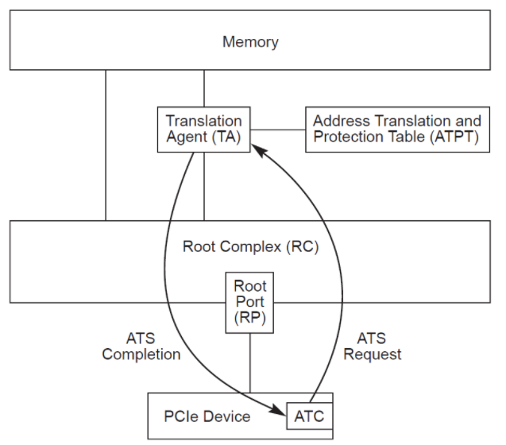
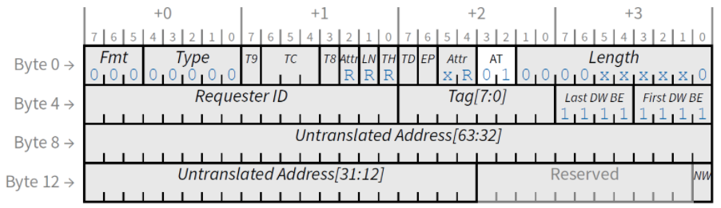

PCIe地址转换服务（ATS）详解

** 1. 为何PCIe需要ATS？**

**1.1 为何需要DMA地址转换？**

  为节省CPU资源，IO function常采用DMA方式访问内存。虽说在诸多实现方案中IO function看到的物理地址空间与CPU无异，但也不乏例外。在有些方案中，IO function看到的地址空间只是真实物理空间的handle，需要RC将DMA请求进行一次地址转换才能将访问到真实物理存储地址，此外还涉及到DMA访问地址空间的合法性检查。幸好，目前绝大部分系统结构都支持对来自IO function的DMA请求进行地址转换。

**1.2 DMA地址转换的益处**

- 确认IO function DMA 请求的合法性，防止非法DMA请求产生破环；支持scatter-gater，通过地址转换，scatter-gather DMA一次传输访问多个物理上不连续的地址块；
- 通过改变传输地址，RC无需与IO function协调即可实现消息信号中断的重定向；
- 可以将32bit位宽的IO funtion映射到更大的系统地址空间；
- 易于实现虚拟化传输。

**1.3 DMA地址转换的不良影响及解决方案**

  RC进行DMA地址转换是需要时间的，相较于不进行地址转换，显然进行DMA地址转换会增加DMA访问的时间。尤其是访问驻留内存转换表时，采用地址转换的方案会大大增加DMA访问的时间。当单次传输需要多次内存访问时，地址转换无疑会大大降低传输效率。

  为了减小地址转换的以上不良影响，设计人员常常在需要进行地址转换的地方添加地址转换缓存（Address Translation Cache, ATC）。在CPU中，这种地址转换缓存通常是指转译后备缓冲区（Translation Look-aside Bufer, TLB）；在IO地址转换中，我们常用ATC来跟CPU的TLB加以区分。TLB与ATC的区别：TLB一次只服务于CPU的单个线程，而ATC服务于PCIe设备的多个IO function，每个IO function都相当于一个独立的线程。

**1.4 设备采用ATC的益处**

设备端的ATC能够减轻地址转换代理（Translation Agent, TA）的地址转换压力；

开启了ATC使设备对系统ATC size的依赖更小；

发往Root Complex的地址都是预先转换过的，潜在减小了访问时延，增加传输效率。

** 2. ATS协议介绍**

  PCIe设备及根复合体RC之间采用请求-完成协议来实现地址转换服务ATS。ATS主要包括两部分：

地址转换（Translation）：用以将ATPT中的转换地址缓存到本地ATC，包括地址转换请求及地址转换完成。

地址作废（Invalidation）：用以当ATPT中地址转换发生变化时，将ATC中的对应转换地址作废，包括地址转换作废请求及地址转换作废完成。

**2.1 ATS地址转换协议（ATS Translation）**

  PCIe Device/Function发送存储器读写请求前，首先在本地ATC查找是否有该地址的Entry。该地址为转换前地址，是DMA看到的虚地址；该地址在ATC中的Entry是指该虚地址经过地址转化后的真实物理地址。若在ATC内查找成功，直接采用转换后地址进行访问，否则给TA发送该虚地址的地址转换请求。

  上图展示了一个基本的ATS转换请求-完成的操作。其动态工作流程如下：
Device/Function产生ATS转换请求，经PCIe拓扑路由到达RC，RC将该请求推给TA；
TA在收到地址转换请求后，查找其本地ATPT，并给Device/Function反馈查找结果（成功或失败）。

**2.1.1 ATS地址转换请求**

  为了实现ATS，存储器读写TLP头标中新定义了地址类型（Address Type, AT）域来表征Device发给RC的地址是否经过了地址转换、是否为地址转换请求。AT域是存储器读请求、AtomicOp及ATS地址转换请求的专属域，在其他事务中该域为Reserved预留。AT域值解释如下：00b->未转换的地址；01b->地址转换请求；10b->已转换的地址；11b->预留。TA检测到AT=11b时会当成UR处理。

1）ATS地址转换请求帧格式

  带有ATC的Device可以选择发送经过/未经地址转换的存储器访问请求。 存储器访问请求的TLP头标（64bit）格式如下图所示。ATS地址转换请求的TLP头标格式与存储器读请求TLP头标格式相似，ATS地址转换请求头标格式如下图所示。

比较可见，地址转换请求与ATS地址转换请求TLP头标的主要区别在于以下3点：

① 地址转换请求的AT=01b，存储器读请求的AT=00b或10b；

② 地址转换请求的地址位[11:0]预留，存储器读请求的地址为[1:0]预留；

③ 地址转换请求有NW域，存储器读请求没有NW域。

  地址转换请求头标中其他各域补充解释如下：

Attr: 转换请求及转换完成没有排序要求，设置该域开启宽松排序，开启宽松排序后TA可根据实际情况决定是否对其收到的事务进行重排，此时发起请求的Device不能依赖TA保序。

Length: 该域用以表明当前转换请求需要返回多少笔转换完成包，每一笔转换完成包长8Byte，多笔转换完成包的地址间STU（最小转换单位）对齐地址递增。需要注意的是，length值需为偶数，最大值为RCB（读完成边界）。若length超出最大值或为奇数，TA会将该TLP当成畸形包进行处理。

Untranslated Address: 需要进行转换的地址，支持32bit及64bit，该地址域不含地址比特[11:0]，TA依据该地址判断转换请求的有效性。对于请求多笔地址转换的情况，若ATPT中的转换后地址不满足转换请求的范围（2^(STU+12)*length/2），TA不会反馈该笔转换包。如果请求者未设置了页对齐，转换请求地址位比特[11:2]可以是任意值，否则必须为0，TA中也必须忽略[11:2]。

NW: 非写标志位，若该位置一，表明该转换后的地址只读，Device不能往该地址发送写请求。若需要写该地址，需要Device重新发送地址转换请求将该位清除。

2）PCIe系统对ATS地址转换请求的处理

  为了减小设计复杂度、简化PCIe系统ATS的集成工作，ATS地址转换请求/完成的处理过程与PCIe读请求/读完成极其相似，在某些方面甚至完全相同，具体表现为：

ATS组件兼容PCIe-1.1组件；

ATS通过新的能力及关联结构进行开启，软件在发送ATS TLP之前需确认该设备具有ATS能力且已开启，否则不能发送ATS TLP，DMA 读写请求中的AT域也应置为0，即未转换的地址。

ATS TLP路由方式为地址或RID路由；

ATS TLP事务排序方式最寻PCIe的事务排序方式；

ATS TLP流经PCIe-1.1交换节点时需保持不变；

Device/Function可以混合发送转换即未转换请求。

  TA收到地址转换请求后会进行如下判断及操作：

判断Device/Function是否开启了ATS能力；

判断Device/Function发送的ATS地址转换请求地址是否合法、该Device/Function是否有权限访问该地址；

判断TA自身是否能够响应该ATS请求；

发送转换成功或失败信号给RC，RC产生请求完成TLP回复给发起转换请求的Device/Function。

3）ATS地址转换请求注意事项 ⚠️⚠️📢📢

Device/Function可以一次连续发送多个地址转换请求，TC可以相同也可以不同。一笔ATS转换请求对应一笔或多笔转换完成，RC一次可以连续返回多笔请求完成TLP，某地址的转换完成TLP的TC需与其转换请求的TC保持一致。

若某虚地址在ATC中没有对应Entry，Device/Function在发送其ATS转换请求并收到转换完成（成功）之前，不能发送标记为translated的该地址存储器访问请求。

ATC只能通过ATS协议进行填充，即发送ATS地址转换请求并收到该地址的转换完成（成功）。

ATC只能通过ATS协议进行修改，主机系统软件只能通过ATS转换作废操作对ATC内容进行修改，其他任何操作都不能修改ATC内容。即使是系统复位、Device/Function的复位操作，也只能更改invalidate entry不能更改ATC内容；

ATS有转换请求超时退出机制，若发出地址转换请求后迟迟等不到转换完成，会超时退出。ATS转换请求的请求超时设置与存储器读请求相同。

**2.1.2 ATS地址转换完成**

  TA在收到地址转换请求之后，需要给Device/Function反馈转换结果。Device/Function收到TA反馈的ATS转换完成包后会根据完成状态更新其ATC或将该地址标记为不存在，并依据完成结果进一步发送经过/未经地址转换的存储器读写请求。

1. ATS地址转换完成帧格式

转换完成TLP头标如下图所示。

​    

Cpl.Status: 地址转换完成状态。000b -> 成功；001b -> 不支持的请求（UR），TA地址转换失败。Device/Function收到该状态后需关闭ATC，且在重新开启ATC之前不应发送任何已转换地址的内存访问请求；010b -> 配置请求重传（CRS），若Device/Function收到该状态，需将其当作畸形包处理；100b -> CA，TA出现异常导致其无法处理该转换请求；其他 -> 预留，若 Device/Function收到该完成状态，当UR处理。只有在状态为000b时才表示地址转换成功，该头标后边紧跟data包，否则没有data包。

Byte Count:

Lower Address:

TC: Cpl/CplD的TC应与该地址的转换请求TC值相同。

  若TA无法对Device/Function要求转换的地址进行转换，TA会回复Cpl，此时Byte Count及Lower Address域需要置0，但实际应用中不建议采用这两个域中的值做任何判断。若ATS地址转换成功，在completion消息包后应紧跟携带有转换后地址的数据包CplD，其格式如下图所示。

​    

各域的解释如下表：

| 域                 | 释义                                                         |
| ------------------ | ------------------------------------------------------------ |
| Translated Address | 转换之后的地址。                                             |
| S                  | 转换size。                                                   |
| N                  | Non-snooped accesses, 非侦探访问标志位，                     |
| Reserved           | 预留，ATC忽略这些位                                          |
| Global             | 全局映射标志位。决定ATC是否将该转换后的地址映射到所有的PASID。 |
| Exe                | 可执行标志位。决定该地址的code是否是可执行的，一般仅用于有PASID TLP前缀且execute requested置一的转换请求。该位置一时，R位必须置一。 |
| Priv               | 特权模式访问标志位。                                         |
| U                  | 置一表示该范围地址仅允许通过非转换的地址进行访问。           |
| W,R                | 标志该地址范围是否可写可读                                   |

​    

补充解释：

Translated Address：Device/Function收到CplD后，若W=0且R=0，或U=1，则Device/Function不能使用当前转换地址。一旦转换地址缓存进ATC，Device/Function不能通过除地址转换作废协议以外的任何方式修改或删除ATC中该地址Entry。在开启ATS之前或收到转换CplD之前，不能通过任何方式填充ATC。开启ATS能力之前的ATC中的内容在开启了ATS后不也能直接使用，要么忽略不用，要不通过invalid协议将其作废，要使用的话需重新发送地址转换请求。

S：值0b表示4096Byte，为1的话，需要继续看地址bit[62:12]的值，bit[12]=1 -> 8096byte，bit[12]=1 & bit[13]=0 -> 16384byte，以此类推，参照图。bit[63:12]全为1时的行为尚未定义。若该size值比STU小，应将该笔TLP视为UR。该规则同样适用于invalidate完成TLP，bit[63:12]全为1时表示invalid所有ATC中的内容。

U：对于命令缓存等复用率很高的地址，将转换后的地址存入ATC，每次访问的时候直接发送转换后地址能够提升效率；但是对于数据缓存等复用率很低的地址，数据变化较频繁，地址映射变化也频繁，这样当地址映射发生变换的时候，TA就可以不用发送该地址的invalid给ATC。但是，当U=1或W/R=1时，ATC可以对该地址的U/W/R/Exe/Priv/S进行缓存，若该地址的这些属性发生变动，TA仍然需要发送invalid给ATC。

注意：地址转换完成TLP可以设置其Attr为宽松排序来提升整体性能。

2）有多笔地址转换的转换完成的情况

  通过设置转换请求TLP头标的Length域，ATC可以在一次地址转换请求中请求TA返回多笔连续虚地址的地址转换。在地址转换请求size（完成长度*4）不大于最大读请求size（或RCB）前提下，Length可设置为所请求转换长度的两倍。若Device/Function请求多笔转换，在不超过转换请求数量的情况下TA可返回一笔或多笔转换结果，即便是TA返回的转换包少于请求的数量，也不视为出错。

  若转换完成包含多笔地址转换数据，所有的转换结果中size必须相同，且相邻地址转换数据对应的虚地址应该是连续的。

  若转换数据的R=0且W=0，TA需设置size域及转换后地址域的低bit位设置合适的值。

  一次成功的ATS地址转换完成应包含至少一笔CplD，转换完成包中每一笔转换地址都在地址转换请求的范围内。

  若转换完成CplD的Byte Count值大于Length值的四倍，则意味着需要额外的转换完成CplD才能结束当前的转换完成事务。

  若转换完成CplD的Byte Count域值等于Length域值的四倍，该CplD意味着其对应转换请求的结束。此时，若Byte Count和Lower Address的和不是RCB的多（>=1）倍，说明当前CplD是这多笔转换完成包序列的最后一笔CplD。若此前没有收到过该地址转换请求的其他CplD，则表明出现错误（请求了多笔只收到一笔，当让是出错了），此前收到的转换结果应全部丢弃。

  注意⚠️⚠️📢📢：若干一次请求了多笔地址转换，实际返回的地址转换完成包数量有可能笔请求的多（CplD序列被拆分），也有可能比请求的少（CplD被截短）。有诸多原因会使TA截短CplD，例如Device、Function请求对一段地址范围的地址进行转换，但只有部分有效，TA就会将无效的部分截去，只留有效的部分并返回CplD，此时有效地址转换的CplD不会报错。有诸多原因会使TA拆分转换完成CplD，例如地址转换请求的地址范围跨越了RCB边界，TA就会将一笔请求完成拆成两笔CplD进行发送。

**2.2 ATS地址转换作废协议（ATS Invalidation）**

  如果TA发现其本地某个地址映射发生变化，其需告知Device/Function无需继续在ATC中维护该虚地址Entry。TA通过给Device/Function发送一笔或多笔带有作废地址信息的地址转换作废请求来关闭ATC中该虚地址Entry，单笔作废请求对应至少一笔作废完成包。以单笔地址转换作废请求及作废完成为例，ATS地址转换作废操作如下图所示。

​    

  ATS地址转换作废动态流程有以下三步：

系统软件更新TA的地址转换表ATPT后，TA发送对应地址的转换作废请求给Device/Function；

Device/Function收到来自TA的地址转换作废请求后，将其ATC指定虚地址Entry清除（但也不能立即清除）。但Device/Function不必立即清除其ATC中的对应entry；

Device/Function在确保发送队列中所有使用待作废转换后地址TLP传输到TA之后，反馈作废完成包给TA。作废完成TLP中的ITAG应与其作废请求中的ITag保持一致（仅针对单笔Cpl，多笔Cpl的ITag Vector可以合并）。

**2.2.1 ATS地址转换作废请求**

  如前文所述，当TA端地址映射发生变动时，其需要将这种变动告知ATC，使ATC中的相应地址变换作废。TA通过发送地址转换作废请求给ATC来保证ATPT及ATC地址映射的一致性。地址转换作废请求TLP的头标格式如图所示。

​    

  地址转换作废请求是带有64bit数据载荷的消息MsgD，其数据载荷中有携带有待作废的地址范围的起始值。地址转换作废请求TLP头标可采用任意TC值。作废请求中Itag值范围为0~31，用以对发出去的作废请求加以区分。在收到某笔作废请求的请求完成之前，该笔作废请求使用的ITag不允许重复使用。

  若ATC在收到的作废请求size小于STU，ATC可以将其当作UR处理，也可以不全作废地址范围为大于等于STU。Device/Function在收到作废请求后需要在~1分钟（+50%-0%）之内回复完成，否则ATPT会通报等待作废完成超时并释放该作废请求使用的ITag。

  作废请求的数据载荷TLP格式如下图所示。S域用以指明要作废的地址范围，使用方法与转换请求S域相同。Glocal Invalidate域是全局invalidate标志位，决定ATC是否将该作废请求应用到所有的PASID。地址位bit[63:12]全为1时表示invalid所有ATC中的内容。

​    

**2.2.2 ATS地址转换作废完成**

  Device/Function完成TA的地址转换作废操作后回复作废完成消息给TA。作废完成消息TLP格式如下图所示。

  地址转换作废完成包是基于ID路由的消息事务，Requester ID是该ATC所在的Function ID，Device ID是发送作废请求的TA ID，其值与作废请求的Requester ID相同。考虑到一个ATC仅对应一个TA，ATC可以在其收到的第一笔作废请求中提取出Request ID作为完成事务的Device ID，接下来的每次作废完成包中都采用该ID作为Device ID，而不必每次都重新提取，从而提升系统传输性能。

  完成计数域CC表示针对当前作废请求ATC需要反馈的作废完成包的数量，CC域为0时表示要发送8笔响应。TA端应能收集这些作废完成包并根据CC及ITag判断某笔作废请求是否成功完成。

  作废完成包可以采用任意TC值进行发送，其值与作废请求包的TC无关。

  ITag Vector用以表明该作废完成包对应哪笔作废请求，ITag Vector域与作废请求包中的Itag值相呼应。比如作废请求包中ITag值为a，则作废完成包 ITag Vector的bit[a]应为1，其余位为0。对于仅ITag Vector不同但TC、CC、requester ID完全相同的多笔作废完成包，也可应将这几笔作废完成包的ITag Vector或在一起，从而合并成为一笔作废完成包。

  如果某Device/Function不支持ATS却收到了地址转换作废请求，该Device/Function会将其作为UR处理。带有ATS能力的Device/Function，即便其ATS没有开启，也应能够接收作废请求并回复作废完成。

  注意⚠️⚠️📢📢：

  ATC回应作废完成之前必须确定一下几件事：

所有新发起的请求不能使用旧的已经作废掉的转换地址；

发送队列中所有采用旧的已作废转换地址的outstanding读请求必须已经完全发送完毕或者被废弃；

发送队列中所有采用旧的已转换地址的outstanding转发写请求必须已经被全部发至TA。若ATC不知道写请求是否到达TA，则ATC需采用与写请求相同TC发送作废完成包，有多少笔TC不同的写请求就采用与该笔写请求相同的TC发送多少笔作废完成包，通过相同TC事务间的PCIe事务排序规则来确保写请求能够先于作废完成包达到TA。这些作废完成包的CC值应相同。

**2.2.3 ATS地址转换作废流控（Invalidate Flow Control）**

  对于不同的设计，其cache结构及排队策略也不同，这也意味着地址作废包的时延及吞吐量不同，这就难免出现TA发送作废请求的速率超出ATC的服务速率情况。当TA发送作废请求的速率超出ATC的服务速率时，由于其流控机制的信用量耗尽，会阻塞TA继续发送作废请求，这也会阻塞其他采用相同流控信用量的事务，从而影响性能。为避免这种情况的发生，可在TA端软件设计更高级的流控机制。

  为了实现流控，ATC必须在反压之前及时公布其作废请求事务的信用余量。

  在以下几种情况时，可以不开启地址作废流控：

Device/Function有能力处理以最大速率达到的作废请求；

Device/Function极少出现反压的情况，出现反压对性能影响也可以忽略不计；

Device/Function能够在不反压的情况下缓存下所有发过来的作废请求。

2.3 ATS协议存在的问题及解决办法

  ATS服务最大的问题在于它是基于信任的，是ATC自己声称它发出的地址是经过翻译还是没有经过翻译的。如果ATC生成这个地址已经翻译，就可以越过IOMMU的隔离。这个问题可以通过ACS来保护，ACS能够决定一个TLP能够正常路由、阻塞或重定向，可以在桥上禁止ATS消息。

** 3. PCIe ATS配置**

  所有支持ATS的Function扩展配置空间中必须有ATS扩展能力结构，如下图所示。

  ATS扩展能力结构分为3部分：

PCIe扩展能力头标，用以表明该Function具有的能力；

ATS控制寄存器，表明该ATS invalidate queue的深度、是否支持页对齐、是否支持全局invalidate、是否支持宽松排序；

ATS能力寄存器，用以设置STU及启用ATS。

  分别如下图所示。

​    

**📖 参考**

PCI Express Base Specification Revision 5.0 Version 1.0 (22 May 2019)

PCI Express Technology - Comprehensive Guide to Generation 1.x, 2.x and 3.0. Mike Jacson, Ravi Budruk, MindShare, Inc.

PCI-SIG, Address Translation Services(PPT)

Address Translation Services Revision 1.1, January 26, 2009

[ARM系列 – SMMU（一）](https://aijishu.com/a/1060000000208280)

[ARM系列 – SMMU（二）](https://aijishu.com/a/1060000000209080)

[IOMMU原理分析以及在Linux中初始化](https://blog.csdn.net/weixin_42092278/article/details/115250122)

PCIe/SMMU ATS analysis note

Introduction to PCIe Access Control Services

PCIe SR-IOV：为什么需要SR-IOV

Linux source code

————————————————

版权声明：本文为CSDN博主「MangoPapa」的原创文章，遵循CC 4.0 BY-SA版权协议，转载请附上原文出处链接及本声明。

原文链接：https://blog.csdn.net/weixin_40357487/article/details/120245027